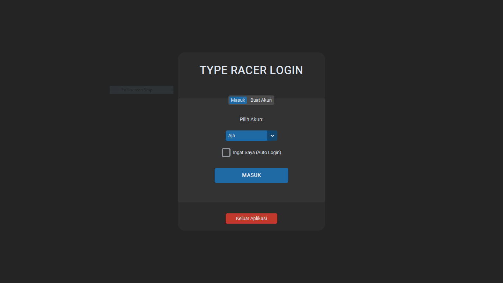
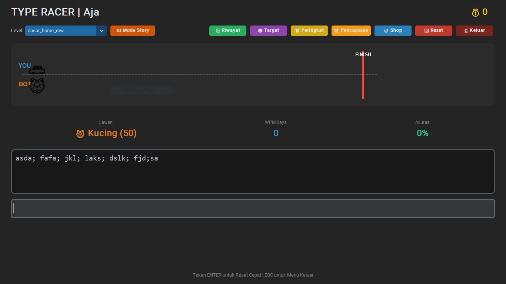

# 🚗 Python TypeRacer - Multi User RPG Edition

**Python TypeRacer** adalah game mengetik cepat (typing game) berbasis desktop yang dibangun menggunakan Python dan **CustomTkinter**. Game ini menggabungkan latihan mengetik dengan elemen RPG ringan, sistem ekonomi, dan manajemen akun multi-user.


## 📸 Screenshots
*(Tambahkan screenshot aplikasi di sini agar repo terlihat menarik)*
> 
> 

## ✨ Fitur Utama

### 🔐 Sistem Multi-User
* **Login & Register:** Buat akun baru atau masuk ke akun yang sudah ada.
* **Fitur "Ingat Saya":** Auto-login saat aplikasi dibuka kembali.
* **Keamanan Data:** Progres (koin, skin, achievement) disimpan terpisah untuk setiap pengguna.

### 🎮 Mode Permainan
1. **Arcade Mode:** Pilih tingkat kesulitan dan lawan bot dengan kecepatan bervariasi.
2. **Story Mode (Mode Cerita):** Ikuti alur cerita per chapter dan buka achievement setelah menyelesaikan chapter.

### 🏆 Progres & Ekonomi
* **Toko Kendaraan (Shop):** Gunakan koin untuk membeli skin kendaraan baru (Mobil, UFO, Roket, Naga, dll).
* **Sistem Mata Uang:** Dapatkan koin berdasarkan kecepatan (WPM) dan kemenangan.
* **Achievements:** Klaim hadiah koin setelah menamatkan cerita.
* **Target List:** Lacak bot yang sudah kamu kalahkan.

### 📊 Statistik & Peringkat
* **Leaderboard Global:** Bandingkan koinmu dengan pemain lain. Top 3 mendapat warna khusus (Emas, Perak, Perunggu).
* **Riwayat Pertandingan:** Catatan detail setiap balapan (Lawan, WPM, Akurasi, Tanggal) dengan paginasi halaman.
* **Live WPM & Akurasi:** Statistik real-time saat mengetik.

### 🎨 Antarmuka Modern
* Tema **Dark Mode** yang elegan.
* Animasi balapan visual menggunakan Canvas.
* Update UI instan saat membeli item atau klaim hadiah.

## 🛠️ Prasyarat
* **Python 3.x**  
* **CustomTkinter**

```bash
pip install customtkinter
